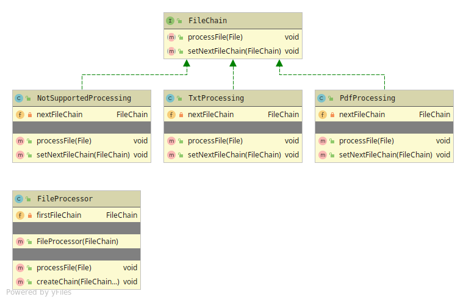

# Chain of Responsibility

Creates a object-chain bound to client request, where every object can
have a partial or full responsibility to handle the request.
Client implementation is crucial for how the chain will work.

Chain of Responsibility has 3(2 if not using a helper class) members
* Handler - Abstraction with its behaviour to accept the request or forward it to the next in the chain.
* Concrete Handler - Implementation of the chain specific handling. HAS-A relationship with the next Handler in the chain.
* Chain Helper - A wrapper class that holds takes the first-chain
and a helper method that creates the full chain.

