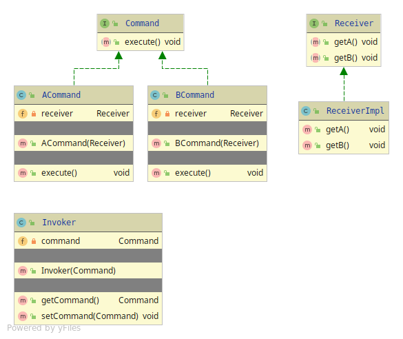

# Command

The Command pattern lets your client requests be encapsulated while 
it can wait or being executed on demand.

A data-structure can be held for queuing and logging in the Invoker.
 
Functional Style programming can be applied by marking the Command to @FunctionalInterface

The Command pattern have 4 members
* Command - The set of Commands the Client can use, the Clients usage
* Invoker - The executor of Commands requested from the Client
* Receiver - The Clients View
* Client

