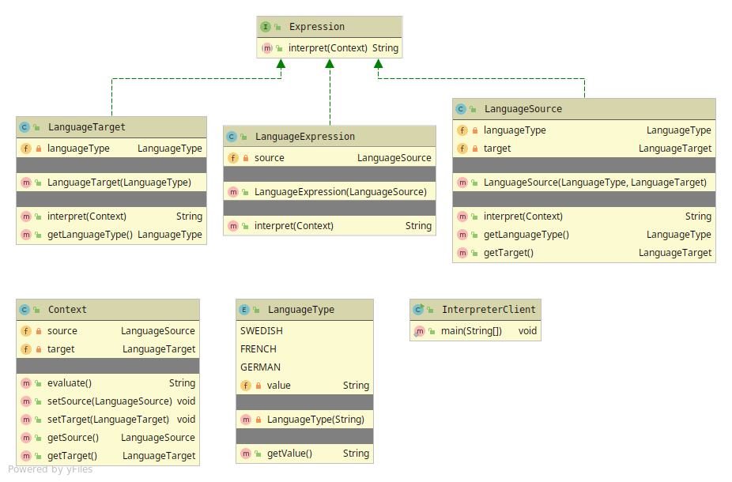

# Interpreter

Interpreter gives the Client a interpreted value given from the client request.

Interpreter has 5 members
* Client
* Context - The data-holder and changes of state, can return the final result.
* Abstract Expression - Abstraction which takes the context as a parameter.
* Terminal Expression - Holds data and will call for the final result
* Non-Terminal Expression - Holds more than one AbstractExpression and manipulates the Context state.

The more complex Expressions the harder to maintain. 

