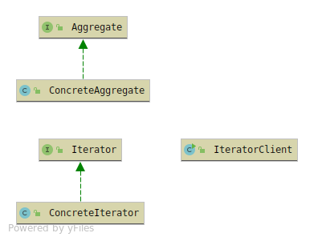

# Iterator

The iterator is being used to traverse trough a collection. 

Iterator pattern has 5 members

* Aggregate - Abstraction contains the creation of the Iterator
* Concrete Aggregate - A class which has a Collection or is a collection
* Iterator - The iterator interface with traversing methods. 
* Concrete Iterator - The implementation and functionallity how the iteration will work.
* Client

