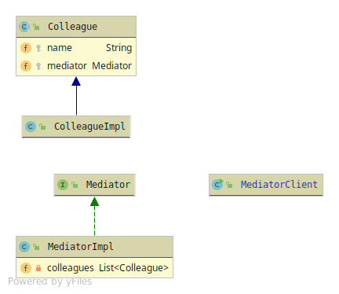

# Mediator

Mediator is a holder of all the Objects attached to it(its Colleagues).
How it holds the Objects can vary from a data-structure or just a member field.

The Mediator makes it possible for Complex Objects to communicate with each other  
in a loosely coupled behaviour. 

The Mediator have 5 members
* Colleague - Abstraction which the sub-classes inherit/implements.
Has-a Mediator object 
* Concrete Colleague - The implementation of the Colleague class/interface 
* Mediator - The behaviour needed for managing and controlling its Colleagues
* Concrete Mediator - The implementation of the Mediators behaviour
* Client

Mediators can grow very big and become very hard to maintain.

