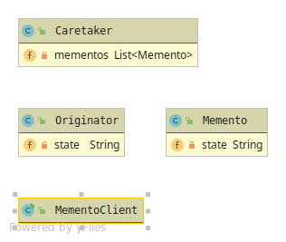

# Memento

Memento pattern is used for saving and restoring an Object state[s]

The pattern has 3 members
* Caretaker - The state saver, has-a data-structure with Memento states 
* Memento - Properties that wants to be saved 
* Originator - Client usage. Can set new state and save,redo state.

To complicated and heavy state changes can affect performance.

