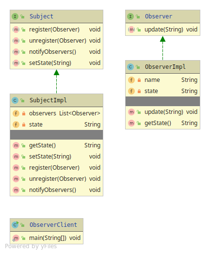

# Observer

Whenever you want a set of Objects to have the same state. 
 Like a subscriber to be notified when a change have been made on the state

The Observer have 5 members
* Subject - The abstraction with notify,add,remove,setState
* Concrete Subject - Implementation of the behaviour has-a data-structure containing Observer
* Observer - The 'subscriber' abstraction has a update() method. Which Subject call when notify.
* Concrete Observer - Implementation of the Observer behaviour.
* Client

