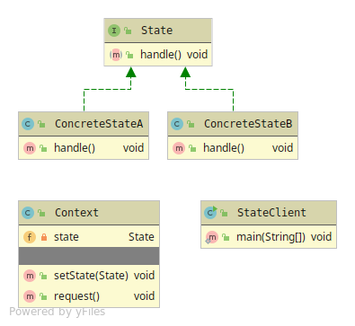

# State

Substitute for a always changing state variable in a Object. Gets rid of the if-else/switch statements check. 
Instead creates new concrete-state classes.

The state pattern has 4 members

* Client
* Context - The state handler class.
* State - Abstraction which holds the handle method that the context will call.
* Concrete State - The state implementation with the states behaviour.

If there is many different states there will be alot of small classes in the codebase.

