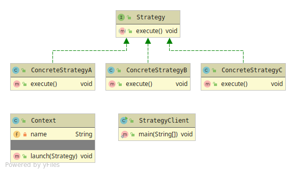

# Strategy
Lets you change the algorithm used for a Object during runtime.

Can be applied for Functional Programming.

The strategy pattern has 4 members
* Context - The strategy executioner Object
* Strategy - The strategy abstraction with its behaviour
* Concrete Strategy - The implementation of the strategy
* Client

##### JDK Usage
* java.util.Collections.sort()

