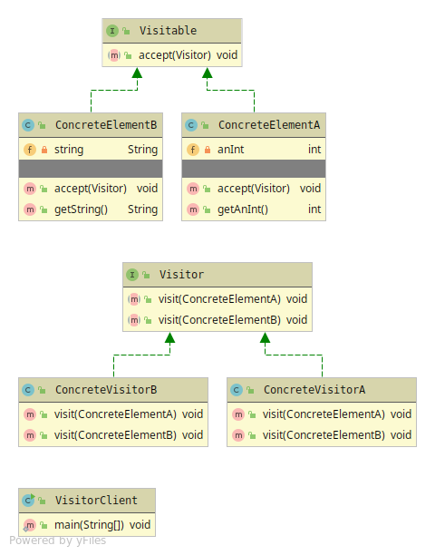

# Visitor
If you have a data-structure with Elements that needs an additional operation.  
But the Object-structure are closed for modification.
Let's you add additional behaviour for the objects inside the structure.

Visitor has 6 members
* Object structure - Data Collection which holds a set of Elements.
* Element - Abstraction with method that takes a visitor
* Concrete Element - Element that calls the visitors visit method using this keyword.
* Visitor - Abstraction with method that takes the right Element in its signature. 
* Concrete Visitor - Implementation where algorithm can be changed when an Element is passed from the Object structure
* Client

