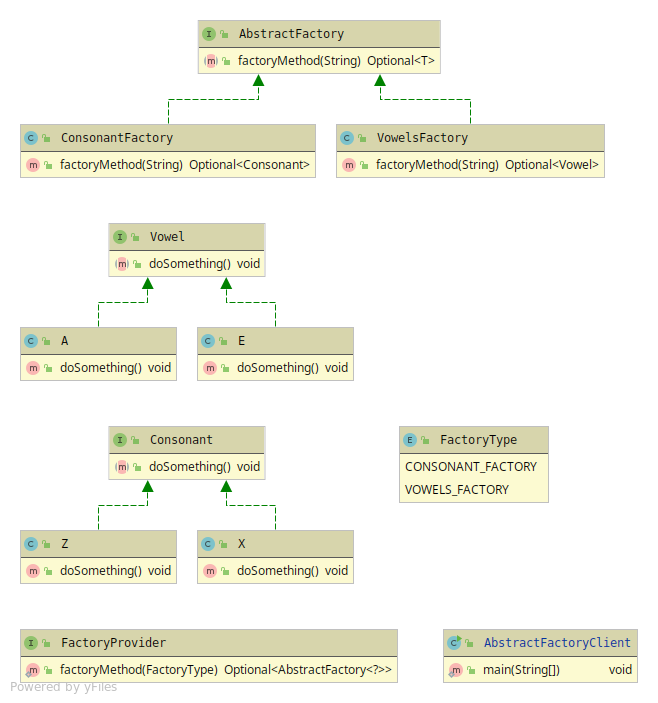

# Abstract Factory 
Basically a factory-method for factories. 
If you want to group objects with its abstractions and its factory-method into families. 

Abstract-factory-method has 5 members
* Abstract Factory - Abstraction for the factories with the factory-method
* Concrete Factory (n) - Uses the abstraction from Abstract Factory, the group of factories. 
* Product (n) - Abstraction for grouping of families
* Concrete Product (n) - Implementation of the product abstraction,the group of products
* Factory Provider - The factory creator.

(n) stands for it can contain more than just one. 
According to how many families you want to group

