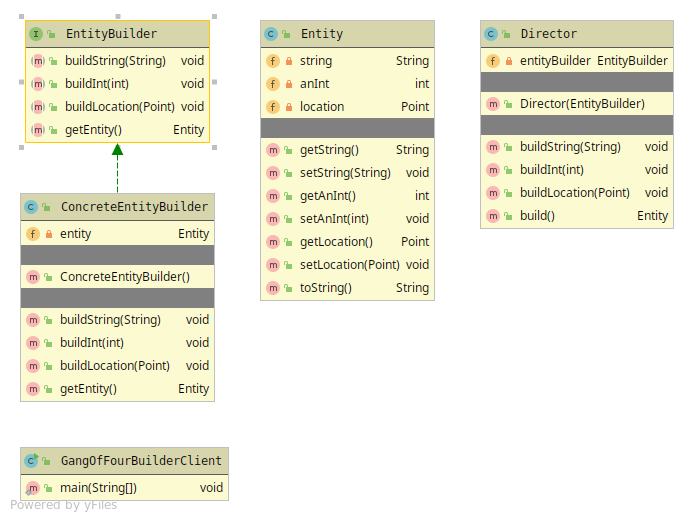
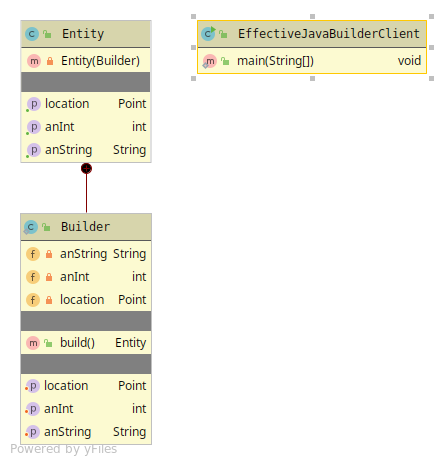

# Builder
Builds a immutable Object, for creation of complex Objects.

## Gang of Four Builder
Have 4 members
* Builder - Abstraction with behavior needed to create the Product
* Concrete Builder - Implementation holding a reference to the product and sets the products properties
* Director - Constructs the Product from its input and returns it using the build() method.
* Product - Object that is being built.

## Effective Java Builder
Creates the Object using a static inner class with a build() method.

  
