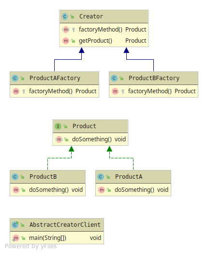

# Factory Method
Creates the Product trough abstraction and lets the 
'Factory-Method' decide which sub-class of the Product to be instantiated.  
The Product creation is made from the input passed to the Creator. 
(In the sample code Enum and String are being used as input parameters)

Factory Method has 4 members in its strictest implementation else 3. 
* Product - Abstraction that are being used to be returned from the factory-method
* Concrete Product - The sub-classes of the abstraction and target 
instantiation class from the input passed to the Creator
* Creator - Abstraction with the factory-method and other behaviour if needed. Only part of the strictest implementation.
* Concrete Creator - Implementation of the factory-method.

Factory method has 3 different implementations
## Abstract Creator
Strict implementation 
Can be many small sub-classes that uses the Creator abstraction

## Concrete Creator
Most common implementation, uses only one factory-method using if-else or switch.
Creation decision is made from factory-methods parameter. 

## Static Creator
Extension from the Concrete creator but is being used in a static manner.

 
 