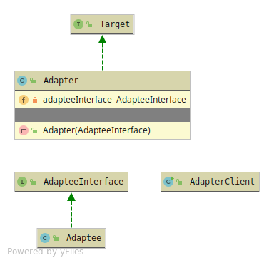

# Adapter
The adapter makes it possible to 'adapt' a abstraction to another abstraction.
Using a Composition relationship in the Adapter with the Adaptee and mimic its behaviour.

The Adapter has 3 members
* Target - The abstraction used to mimic its behaviour from the Adaptee
* Adapter - The implementation of the Target and behaviour mimiced from the Adaptee 
holds a Composition relationship with the Adaptee via its abstraction or concrete.
* Adaptee - The Object that needs to be adapted.

### Class Adapter
The Class Adapter is mainly a pattern for Object-oriented-languages
that supports multiple-inheritance, like: C++. 
It uses inheritance instead of Composition.