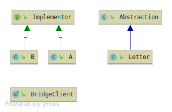

# Bridge
Let's you create a 'Bridge' between the Abstraction and the implementation. 
The Client is unaware of the implementation part, while it's only using the Abstraction.

Bridge has 4 members
* Abstraction - The abstraction in use for the Client, HAS-A relationship with its Implementor.
 Creates the 'Bridge' relationship.
* Refined Abstraction - Implemented behaviour from the Abstraction and user of the Implementors behaviour.
* Implementor - Abstraction with behaviour concerning the Abstraction member.
* Concrete Implementor - Implementation of the behaviour from the implementor.

