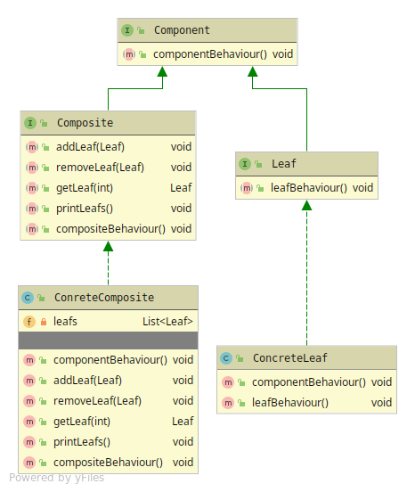

# Composite
Builds a tree structure(Component) that can hold either groups(Composite) or individuals(Leaf) 

The Composite has 5 members
* Component - The base-interface that makes it possible to build the tree.
* Composite - abstraction with Composite specific behaviour
* Concrete Composite - HAS-A data-structure with Leaf's so groups can be made, and also specific behaviour
* Leaf - abstraction with Leaf specific behaviour
* Concrete Leaf - To create nodes in the tree-structure as individual with its specific behaviour

