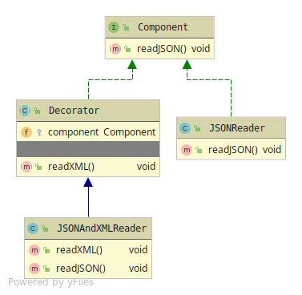

# Decorator
If you want to extend a Concrete implementation. 
With additional behaviour using Composition. 

Decorator has 4 members
* Component - The abstraction used by the Concrete Component
* Concrete Component - The Object that needs extension
* Decorator - Abstraction which HAS-A composition relation with the Component abstraction.
Plus additional behaviour for the extension.
* Concrete Decorator - The extensions implementation using 
the Components behaviour with the extra 'decorated' behaviour.

