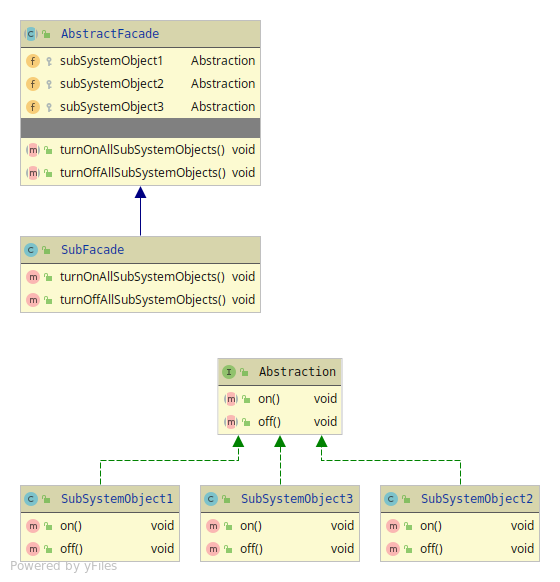

# Facade
Wraps a whole sub-system up into one implementation.
To make it easier for the Client to use the sub-system.

Facade has 3 members
(2 if not using abstraction for the Facade)
* Facade - Abstraction that HAS-A relationship with all of the systems objects, and behaviour.
* Concrete Facade - Implementation of the Facades behaviour.
* Sub-System - The whole system or program that needs wrapping,
since its hard for the Client to use it.

