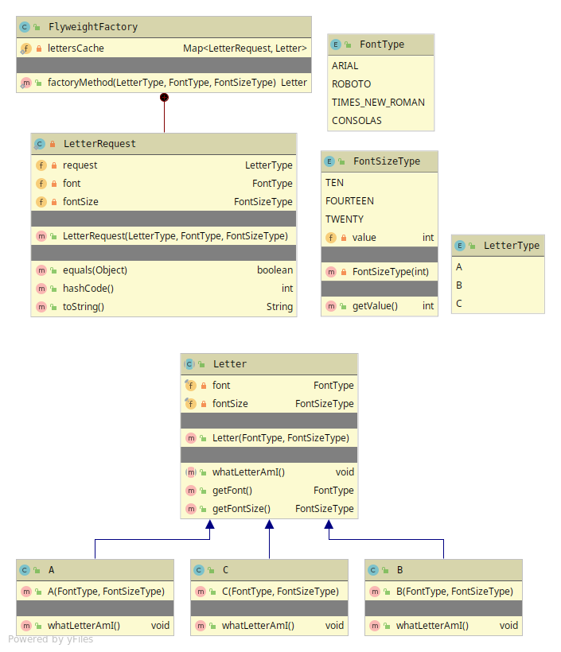

# Flyweight
Generally a idea for a cache-memory.
Basically a Factory-Method with a data-structure that first looks in the data-structure
if exist else create a new Object and put in the structure. 
Pattern used for increased performance and less memory usage in a application.
Flyweight objects should be closed for modification(Immutable).

Flyweight has 3 members
* Flyweight - Abstraction used for Object and for the Factory Method.
* Concrete Flyweight - Implementation of the Object with its Intrinsic & Extrinsic attributes.
* Flyweight Factory - Factory pattern that HAS-A data-structure(Key,Value) 

#### Intrinsic & Extrinsic
* Intrinsic - State that is shared among all the Objects.
* Extrinsic - State that is unique for just that particular instance.

