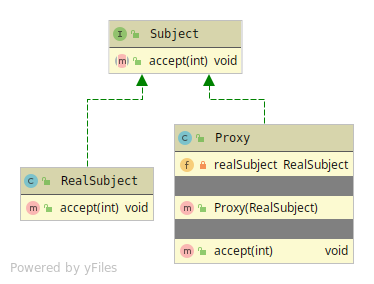

# Proxy
Controls access over an Object, by laying on-top of the Real Object.
Client is using the Proxy,that forwards requests to the Real Object.

Proxy has 3 members
* Subject - The Abstraction shared between Proxy and Subject with its behavior.
* Proxy - The 'Controller' object, that controls the Client from using sensitive operations.
HAS-A relationship with Real Subject. 
* Real Subject - The 'Controlled' object that is being controlled by the Proxy.

